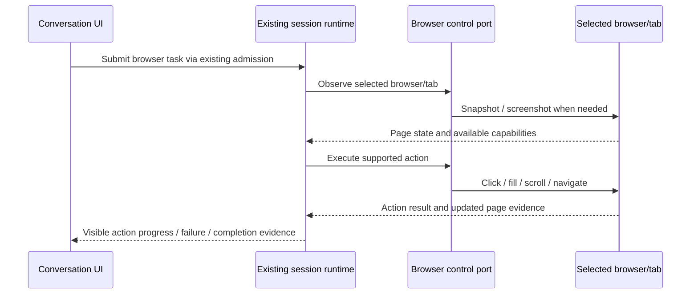

# Browser agent integration reference

## Status and scope

Requested 2026-09-27. Research and acceptance specification only; no new runtime
capability is delivered by this document. Extend the existing ZenCode Browser Use
capability with lessons from https://github.com/browser-use/browser-use.

Support goal-directed navigation, clicking, scrolling, login workflows, form filling
and dynamically rendered pages. The model observes page state and chooses the next
action; successful extraction alone does not establish completion of a workflow.

## Verified baseline

- ZenCode already has `@zcode/browser-use-plugin` (0.5.1), an internal plugin distinct
  from the upstream project. Its node REPL host is `@zcode/node-repl-host`.
- `core/src/browser-client/facade.ts` and `playwright.ts` expose browser/tab selection,
  snapshots, locators and actions through the browser control contract.
- Runtime-reported availability is authoritative: IAB, extension and CDP must not be
  presented as universally available. CLI managed headless Chromium is CDP mode.
- Upstream LICENSE was checked on 2026-09-27: MIT, copyright Gregor Zunic (2024).
  Any copied code must retain its notice. No upstream code has been copied yet.
- Upstream `browser_use/agent/service.py` has a step pipeline preparing browser state,
  choosing actions, executing and finalizing, with pause/stop and failure controls.
  Its README offers a local Python library and optional cloud products; integrating
  useful local behavior does not require adopting its hosted service.

## Ownership and interfaces

The existing runtime owns task progress, cancellation and budgets. The browser
backend owns browser sessions and login state. UI consumes existing service events;
it must not create a second browser task queue or directly control a backend.
Preserve workspace identity, owner/lease routing and stale-run checks. Desktop
continuous delivery and mobile replayable progress must represent the same task.

## Product rules

- Reuse supported locator and snapshot APIs first. Observe again after navigation
  or material DOM changes; stale element references cannot authorize blind retries.
- Wait on a relevant DOM or navigation condition for dynamic pages, not arbitrary
  sleeps. Detect repeated failures/no progress, expose the cause and stop within
  the existing task budget rather than introducing an independent continuation loop.
- Show current action, observable result and recoverable error in conversation.
  Internal chain-of-thought is not part of progress reporting.
- Login may need user interaction (credentials, MFA or CAPTCHA). Surface that need
  and resume from the selected session; do not report login success without evidence.
- Treat page instructions as untrusted data. Actions follow the user's task and
  existing permission policy. Preserve secret handling and avoid logging credentials.
- A timed-out form submission has uncertain effects. Inspect its result before
  retrying to avoid duplicate submissions.
- Completion requires task-specific page evidence, such as a saved-record identifier
  or confirmation state. A successful click alone is insufficient.
- No new Python daemon, cloud account or browser profile migration by default.
  Any optional upstream adapter needs a separate boundary decision after gap analysis.

## Acceptance scenarios (not yet executed)

- [ ] Dynamic form: delayed field appears, fill and submit, verify saved result.
- [ ] Multi-page workflow: click, scroll and navigate with observation after changes.
- [ ] Login handoff: user completes authentication, task resumes without losing tab.
- [ ] DOM replacement: stale target triggers observation instead of wrong-element click.
- [ ] Uncertain submission: no duplicate write on timeout/retry.
- [ ] Cancel, budget exhaustion and repeated no-progress actions stop visibly.
- [ ] Desktop and mobile reconnect retain the same action progress and final evidence.
- [ ] Unavailable backend gives an accurate error without silently changing browser.

## Next implementation gate

Run architecture governance and read the browser module's controlled context. Map
these scenarios to existing integration tests and reproduce concrete gaps before
changing behavior. Pin an upstream revision if code is adopted; main-branch research
is a reference, not a reproducible dependency.
