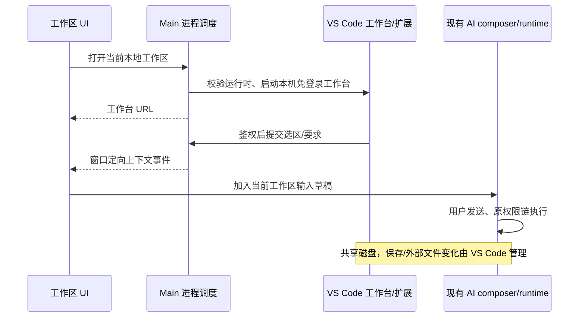

# 完整源码工作台与 ZenCode AI

## 产品规则
移除工作区帮助菜单的产品文档、社群、问题上报、产品需求四个入口，保留桌面更新、关于及资源诊断。新增明确的「源码 IDE」入口，不依赖外部安装的编辑器，也不受 Office 模式过滤。
采用固定版本 code-server（VS Code OSS 工作台），完整提供 Explorer、多文件保存、搜索、Git、终端、扩展宿主；Open VSX 与 VSIX 为扩展来源，不承诺微软专有扩展兼容。构建/开发启动准备阶段按目标平台下载运行时并核对固定 SHA256；发布安装包预置完整运行时，首次打开 IDE 不下载。缺失内置运行时明确报安装包不完整，不回退联网下载。macOS/Linux/Windows 依据上游可用发行包支持。
工作台在现有浏览器侧面板打开，AI 会话保留。内置 ZenCode 扩展提供「将选中代码交给 ZenCode AI」命令，将文件路径、行范围、选中内容及用户要求送入现有 composer 上下文；用户发送后使用现有模型、权限、引导和任务机制。AI 文件修改与工作台共享真实工作目录，不创建第二个 Agent。未保存编辑先提示保存，避免模型读取旧文件。

## 所有者与边界
Main 只拥有工作台子进程、内置运行时定位和本机桥接端口，按窗口/工作区隔离；不保存 task/session 队列。Renderer 通过 IPlatformService/hook 调用；AI 上下文继续通过现有 code-comment composer 接口。workspaceIdentity 优先身份隔离，workspacePath 只用于磁盘和启动目录。远程 workspace 不误启动本地路径；首版入口明确禁用远程，后续需在对应 Host 部署运行时。Web 不显示桌面专属入口，不伪装支持。



服务仅监听 127.0.0.1，桥接令牌随机生成，不落日志；桥接限制正文体积、拒绝非工作区路径、跨窗口事件。扩展只有在 Renderer 确认当前 composer 已接受选区后才提示成功；无活动 composer 或工作区已切换时返回失败，不假称已发送。内置桥接扩展在受限模式只提供显式选区转交，不绕过其他扩展的工作区信任机制。进程退出/窗口关闭清理桥接，启动失败移除 in-flight，重试可再次启动。下载临时目录成功验证后才成为正式安装。

## 验收
- 帮助菜单无四个旧入口，更新/关于保留。
- 源码 IDE 在没有外部编辑器时仍可用；启动期间显示状态，失败可重试；准备构建资产失败则阻止发布。
- 真工作台打开目录、编辑保存文件，扩展命令可被发现；浏览器测试不使用假代码编辑框。
- 选区与要求进入同一工作区 AI 输入，跨工作区拒绝，未保存文件明确处理。
- 鉴权、路径隔离、安装平台选择单测；UI 入口交互测试；类型、Lint、架构检查如实报告。
- 不将本机 macOS 验证冒充 Windows/Linux 或完整 Marketplace 兼容性验证。

## 本次验证记录（2026-09-29）
- 3 项协议/平台/路径隔离单测通过。
- `node --test packages/ui/tests/code-workbench.e2e.mjs` 通过：入口 loading、打开 URL、工作区隔离、composer ACK、帮助菜单移除。此为组件浏览器测试，不是打包 App E2E。
- `ZENCODE_IDE_TEST_ROOT=/tmp/zencode-workbench-verification pnpm exec tsx --test packages/desktop/tests/code-workbench-runtime.e2e.ts` 通过：真实 macOS ARM64 运行时下载与校验、密码登录、VS Code 工作台、真实编辑保存、扩展命令及 HTTP 上下文回传。测试桥接接收端不调用付费模型。
- `pnpm typecheck`、`pnpm lint`、`pnpm architecture:check --changed` 通过；Lint 有 74 条警告。
- 额外 Desktop main/preload/renderer 独立 tsc 检查失败：现有 rootDir/include、DOM 类型、shared 导出及 window.zcode 全局声明等错误；未把这些检查记为通过。
- 没有重启用户当前 App，没有验证打包 App 内的端到端操作、Windows/Linux 实机、远程 Host 或所有第三方扩展。

## 预置资产修正
唯一资产准备入口为 prepare-code-workbench.mjs；生产 prepare:runtime-assets、开发 pre-dev 调用它。electron-builder beforePack 验证目标平台资产，extraResources 放入 resources/code-workbench（asar 外，保留可执行权限和上游许可证）。Main 仅解析打包资源或开发 bundled-workbench 目录，绝不下载。验收包含：缺失资产拒绝发布/启动、目标平台匹配、离线启动真实工作台。

预置修正验证：本机 darwin-arm64 构建资产已准备并复核；4 项运行时/边界单测、2 项打包检查、1 项组件浏览器测试通过；真实工作台测试在浏览器禁用外网时完成启动、保存和上下文回传。未重新生成或签名发布安装包，不冒充已验证全部平台安装包。

## IPC 启动入口回归
IPC handler 内不得以局部 process 遮蔽 Node process。开发与打包路径均经真实 registerCodeWorkbenchIpc handler 测试，再交给子进程调度；不能用独立 startWorkbench 测试代替应用入口验证。验收需断言路径正确、不发起登录请求、URL 返回。失败提示通过独立浮层呈现，避免被 header overflow 裁切。

## 本机 IDE 免登录（用户明确要求）
仅本机预置工作台使用 --auth none，固定监听 127.0.0.1；不发起 /login，不设置 cookie，不依赖历史登录态。AI 回传桥接仍校验独立随机令牌、窗口 ACK 与工作区路径。不得把免登录模式复用到远程或公网。该模式下其他本机进程也能访问工作台。验收：无 cookie 直接加载工作台、源码编辑保存与 AI 回传通过；IPC 不进行登录 HTTP 请求。

## IDE 全工作区模式
点击源码 IDE 后，工作台占满主工作区；现有 conversation-column 改为右下方 AI 浮动停靠区，不再占左侧一半。保留原 SessionPane/composer 实例、草稿、附件、模型选择、权限和运行中引导，不新增第二个 AI 输入所有者。草稿欢迎页在此布局隐藏，输入框靠底；历史回复仍可在停靠区查看。提供返回对话按钮，恢复原分屏布局；关闭/切换离开 IDE 页自动恢复。仅对本次启动返回的工作台 URL 启用，普通网页布局不变。

```text
IDE 打开成功 → shell 记录 URL/工作区布局偏好 → 原浏览器面板铺满
                                       └→ 原 conversation-column 右下停靠（同一 composer）
退出 IDE 布局/切换普通 tab → 恢复原有分屏，不重建任务或输入区
```
验收：IDE 面板占满主区、AI 仅挂载一次且位于右下；输入草稿在进入/退出时保留；普通浏览器不受影响。

## 窄 AI 工具栏不重叠
复用输入框的自动收缩规则后，如果仍有不支持收缩的 Office/创作入口，必须在左侧剩余宽度内换行；发送/停止按钮保留独立右侧空间。不裁剪或隐藏可用操作。布局 hook 只拥有 DOM 投影，不改变业务状态。验收 320/400/440px 宽度下所有操作与发送键矩形不相交。

## AI 停靠区收起
AI 标题栏提供收起/展开，收起只显示 44px 标题栏；消息和输入 DOM 保持挂载但隐藏，不丢草稿、附件，不停止任务或改变队列。布局状态由现有 workbenchFocus 持有，不创建业务状态副本；新打开 IDE 默认展开。按钮保留 aria-expanded 与文字标签。验收：收起尺寸、展开恢复、草稿不丢且 composer 不重复挂载。

## 从扩展网页导入
工作台命令面板提供「ZenCode: 导入扩展 / Import Extension」，扩展侧栏标题菜单也提供入口。用户粘贴 Open VSX、Marketplace 页面、vscode:extension 链接或 publisher.name；只解析明确域名与扩展 ID，不执行网页内容，不接管系统 vscode 协议。链接交给工作台扩展搜索并由用户点击原生安装按钮；Marketplace ID 使用工作台配置的 Open VSX，未收录时可选择本地 VSIX。VSIX 经原生文件选择器与安装确认后交给 VS Code 安装。扩展管理器独占安装、版本与重载状态；ZenCode 不维护第二份扩展注册表。

```text
用户粘贴链接 → 严格解析 ID → VS Code 扩展搜索 → 用户原生安装 → 扩展管理器持久化
用户选择 VSIX → 明确确认 → 原生安装命令 → 成功/错误通知
```
验收：支持四类输入、拒绝伪装域名/无效 ID；取消无副作用；命令真实可发现，安装错误可见。网页上的全局「Open in VS Code」不自动改指向 ZenCode，使用复制链接导入；不承诺微软专有扩展兼容。

扩展导入验证记录：链接解析单测通过；真实工作台中导入命令、网页链接输入与扩展搜索通知实际通过。整套工作台 E2E 在编辑输入/保存回归阶段失败，不能记为全部通过。未验证第三方扩展在线下载、本地 VSIX 完整安装或打包 App。typecheck、lint（73 warnings / 0 errors）、architecture:check --changed 通过。内置扩展保留既有安装目录与版本以复用工作台注册位置，不自行修改 VS Code extensions.json。

## AI 发送后保留 IDE 前台
IDE tab 显式标记 purpose=code-workbench，属于工作区级页面，不按草稿或任务 ID 隐藏。发送导致 draft → task / owner 变化时，当前 IDE 优先于目标任务记忆的 tab，保留 IDE 布局；不重载工作台、不重建 composer。手动切换 tab、关闭和收起仍有效。普通 browser/browser-use 保持任务隔离。唯一状态所有者仍为 useAppPanels，Shell 只在打开 IDE 时传递 purpose。

```text
Shell 打开 IDE → useAppPanels 创建带 purpose 的 tab
AI 发送 → task owner 更新 → scope resolver 保留当前 IDE → 原 webview/composer 持续挂载
```
验收：草稿转正式任务后 IDE 仍可见且 active；目标任务旧 tab 不抢焦点；其他工作区不可见；普通网页不跨任务；手动切换有效。

IDE 前台保留验证：`node --test packages/ui/tests/code-workbench-focus.e2e.mjs packages/ui/tests/code-workbench-layout.e2e.mjs` 两项通过（真实浏览器中的组件/状态解析测试，非打包 App）；`pnpm typecheck`、`pnpm lint`（73 警告、0 错误）、`pnpm architecture:check --changed` 通过。未重启或重新构建当前桌面应用，已有未带 purpose 的 IDE tab 需关闭后从源码 IDE 入口重新打开。

## IDE 拖入 AI 文件引用
接收 VS Code 的 ResourceURLs、CodeFiles、application/vnd.code.uri-list 与 text/uri-list 文件拖拽。仅将当前工作区内的本地 file URI / 绝对文件路径转换为已有 @ 文件引用，不上传、不执行、不自动发送；多选去重后逐项插入。拒绝远程 URL、工作区外路径、畸形 JSON；系统 File 附件保留原入口。引用以保存后的磁盘文件为准，不代表 IDE 未保存缓冲区。
状态仍由原 composer 草稿拥有。纯解析适配器只产生 WorkspaceFileDragPayload；ChatPromptEditor 和 ConversationComposer 共用解析与插入接口。drop 消费后停止冒泡，防止重复加入。

```text
IDE 文件树/编辑器 tab → DataTransfer → 工作区路径校验 → 现有 composer mention → 用户发送 → 原 AI 文件读取
```
验收：中文空格路径、多个文件、重复文件、URI/CodeFiles 格式；工作区外/伪装前缀/远程 URL 拒绝；浏览器拖入后出现引用且不触发上传、不重复插入。

## @ 文件候选新鲜度
现有 FileService 无文件变更订阅。文件候选面板打开时强制刷新 Host 索引；面板可见期间每 3 秒完成一轮后再刷新，窗口重新聚焦时也刷新。关闭或隐藏面板停止轮询；同一 effect 内请求串行，旧 query/workspace/connection 的返回不写入当前列表。输入变化仍走缓存搜索，不按每个按键强制全量扫描。刷新保留当前列表避免闪烁；失败显示错误并停止轮询，重新打开可重试。这是有界轮询更新，不宣称文件系统事件级零延迟。
内置 code-server 使用 vscode-remote URI 表示本机资源，因此同时允许 loopback（127.0.0.1/localhost）的 vscode-remote URI，仍执行工作区路径边界校验；不接受其他远端主机。

## @ 文件完整候选
空查询不再截取前 10 个文件；与搜索查询使用相同的 1000 条显示安全上限。源码、JSON、Markdown、图片、Office 等按文件索引统一展示，不按扩展名筛除。大于 1000 条的工作区输入名称搜索全索引；仍尊重用户 .zcodeignore 以及依赖/版本库内部目录规则。验收用 14 个混合类型文件复现原先后 4 项丢失的问题，空查询必须全部返回。
候选完整性回归通过：14 个混合文件包含 Python/Markdown/JSON/图片/Office，空查询均显示；新增/重命名与关闭停止刷新仍通过。这里的“不按扩展名筛除”指普通源码与文档；既有编译二进制、.env 及用户忽略规则保持不变。列表显示上限仍为 1000，名称检索针对完整索引。

## IDE 启动失败诊断
工作台子进程 stdout/stderr 使用管道，保留最多 8 KiB 的近期 stderr；启动退出必须返回 exit code / signal 和脱敏摘要，不能仅返回通用 exited。替换工作区、运行时、用户目录和桥接令牌；按通用 token/password/authorization 字段脱敏。通过 Main 原 logger 记录同一摘要，不创建业务状态或自动清理用户配置。启动失败释放 bridge，允许重试。测试真实子进程非零退出及敏感值脱敏；无法复现用户退出时明确报告未知，不声明故障已解决。
启动诊断验证：两项测试通过（真实子进程 exit 77、stderr 脱敏、连续重试）；typecheck、lint 和架构检查通过。尚未复现用户启动退出原因，诊断增强不等于已修复该退出故障。
