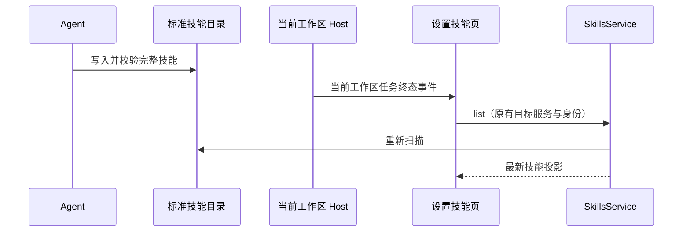

# 对话添加技能与设置同步

## 产品规则

用户在对话中要求创建或安装技能时，Agent 默认将完整技能目录保存在个人 `~/.zcode/skills/<name>/SKILL.md`；明确仅当前项目时保存到 `<workspace>/.zcode/skills/<name>/SKILL.md`。显式指定其他路径时遵从用户，并说明该路径是否能被自动发现。安装必须保留脚本/素材/引用文件，校验 SKILL.md 的 name/description，读取验证后才能声称完成；加载一个技能不等于安装。

设置页与 Agent 已共同发现 `.zcode/skills`、兼容 `.agents/skills` 和注册插件技能；不再增加另一份“已安装”登记表。文件系统为唯一事实，SkillsService 负责发现，UI 只保存投影。

## 刷新与顺序

设置页打开、窗口重新获得焦点、页面恢复可见、工作区任务结束时刷新。对话可能在失败前已写入技能，因此 error 终态也刷新。使用同一目标服务和 `workspaceIdentity?.trim() || workspacePath` 隔离本地/远端；切换目标/断连/卸载使旧请求无效。沿用现有共享技能 store 刷新接口同步提及菜单。连续事件在当前刷新结束后至多补一轮，不用定时轮询掩盖同步问题。

Desktop continuous 收到终态事件立即重扫；Web replayable 重连后通过已有 rpcReady 初始化重扫，漏掉的离线事件不能导致永久陈旧。

## 验收

- 首个技能目录原本不存在，AI 创建后设置重新打开能看到；设置页已打开时在任务完成后自动出现。
- 当前 Host 终态/焦点恢复触发刷新；其他 identity 的事件、流式正文更新不触发。
- 切换工作区后，旧扫描晚返回不能覆盖新目标；卸载后释放订阅。
- 同一目录中的脚本资源仍可用，设置启用状态逻辑保持一致。
