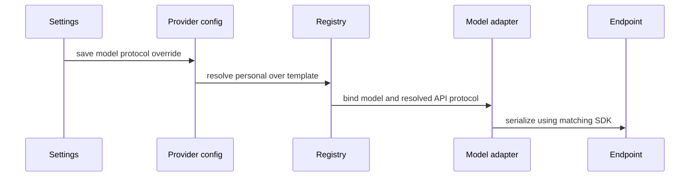

# Per-model API routing

Provider config owns `api.modelApiTypes`, an optional map from exact model ID to API type.
A null entry explicitly inherits the provider-wide type. Personal maps overlay template maps
per entry. Unspecified models use the provider type. ZenMux's built-in Grok 4.7 entry uses
Responses because its file input is rejected on Chat Completions. Other models are unchanged.
Settings exposes the map next to the existing connection protocol selector and uses the same
serialized draft/save command. No credentials or second persistence store are introduced.

Protocol changes affect subsequent bindings; already running requests retain their snapshot.
Both desktop and remote clients use the same persisted provider configuration. Invalid enum
values fail schema validation. No automatic network retry or protocol guessing after errors.
Acceptance: Grok PDF produces /responses input_file; other ZenMux models retain Chat;
explicit model selection survives serialization; null inherits provider default; settings save
failure remains visible via existing feedback. UI scenario: choose a model protocol, reopen
Settings, verify selection and issue an attachment request through the selected endpoint.
