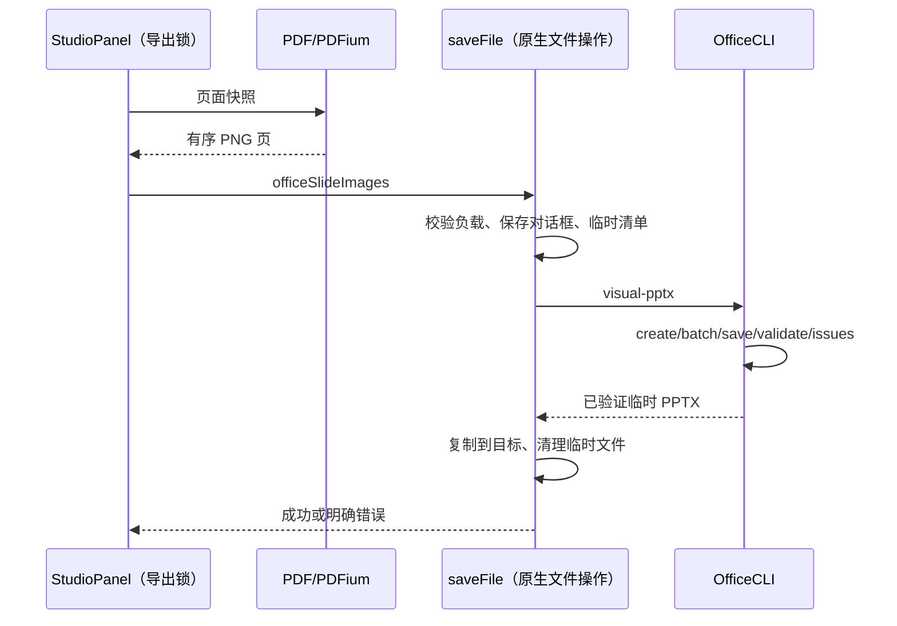

# OfficeCLI 兼容导出

## 产品规则

PPT 保真导出使用现有预览 → PDF → PDFium PNG 链路，然后由 OfficeCLI 构建一页一图的原生 PPTX，16:9，顺序和页数完整。该格式不支持元素级编辑，原可编辑导出不变。OfficeCLI 不具备已验证的原生 PDF 转可编辑 PPT 接口，不声称有此能力。

OfficeCLI skill 内置 compatibility.mjs，提供 visual-pptx（PNG data URI 清单 → PPTX）和 check（docx/xlsx/pptx 保存、OpenXML 校验、issues 报告）。默认不改用户源文件；所有输出先在临时目录生成和校验，成功后才发布到用户选择位置。schema 校验失败不得返回成功。issues 报告必须保留，不等同于 WPS/Office 视觉验收。

Desktop saveFile 增加 officeSlideImages 分支，只接收 PNG data URI、非空且最多 500 页、总解码大小最多 50MiB。Main 只执行文件导出和工具进程调度，不保存任务状态。UI 通过 IPlatformService 调用，同一 pdfExportLock 串行化。Web 没有原生 saveFile 实现时不暴露此入口。

## 所有者和顺序

## 打包

桌面与远程 skill 清单必须包含 compatibility.mjs。CLI launcher 保留固定版本与 SHA256 校验、离线缓存；打包预置的二进制仍必须验哈希，不能使用未验证系统工具。首次下载失败必须报告失败，不能静默改用另一个导出器。

## 验收

- 实际两页 PNG 经 OfficeCLI 生成 PPTX：页数两页、各一个图片、坐标 0/0、16:9、图片数据相同；validate 成功。
- 非 PNG、空清单拒绝；失败不能覆盖已有输出。
- check 支持 docx/xlsx/pptx，实际创建和检查 Word/Excel 样例。
- 现有 PDF/可编辑导出测试保持；typecheck/lint/architecture 实际执行。
- 没有 Windows Office/WPS 时明确未做对应视觉验收。
