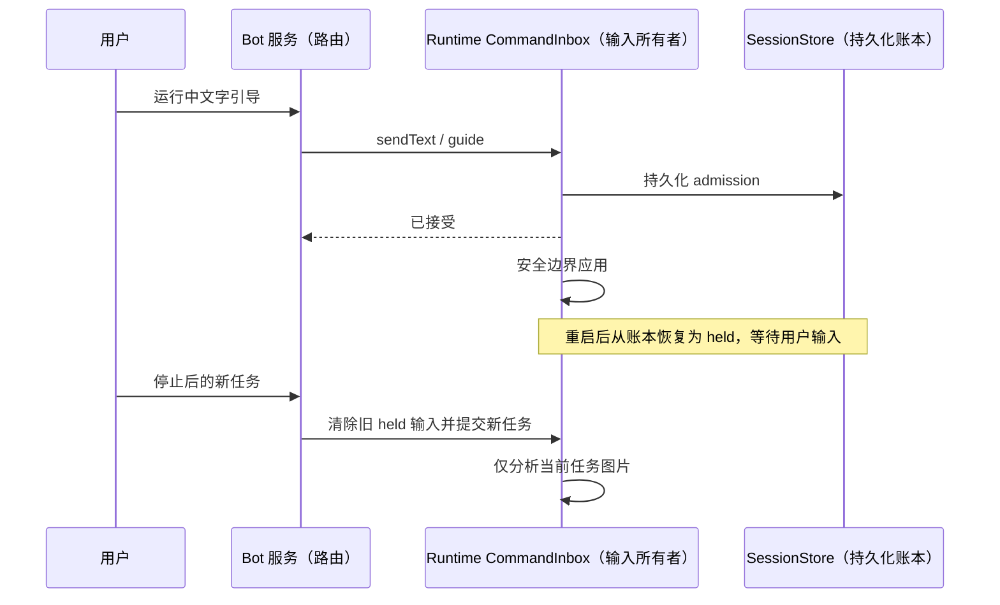

# Running text guidance and stopped-task isolation
Running Weixin text input goes through the existing v4 sendText CommandInbox with
requestedDelivery=guide; do not use the normal start-turn facade that clears live
projection. ACK means accepted, not applied. Existing runtime safe boundary injection,
owner/lease and command deduplication remain authoritative. Attachments during running
receive an explicit text-only guidance message rather than being silently dropped.
Stop remains the existing stop command.

Preserve unconsumed user sendText guide ledger records on cold resume and reproject
them as held inputs, with original identity and submission metadata. Do not execute
them during hydration. Ordinary queue/background wake handling is unchanged. Text
guide persistence failures propagate rather than claiming durable acceptance.

New input after stop must not automatically analyze old image batches. Only explicit
continuation reuses the original task's images; new substantive input sees historical
image placeholders and current-turn images. Persisted originals/checkpoints remain.
Scope: large image collections (>10); small normal visual followups retain existing
behavior. A model can explicitly reread original files when new task needs old media.

验收：51 张历史图片后输入“PDF 在哪里？”不触发批量分析；明确“继续”
仍复用原任务检查点；恢复未消费引导不调用模型；账本读取失败不得报告恢复成功。

## 微信显式继续和引导
- `继续执行`、`继续`、`/continue`、`/resume` 恢复当前绑定任务；可在逗号、冒号
  或空格后附加引导，例如 `继续执行，先处理剩余图片，最后输出 PDF`。
- 继续输入复用当前 session 和 held 输入，跳过新任务意图分类，不重新创建生图/PDF
  任务。没有绑定任务或任务已删除时说明无法继续，不创建空任务。
- 运行中 `/guide 要求` 或普通文字进入既有 CommandInbox 引导通道；裸继续只回复
  “任务正在执行”，避免重复 admission。中断时 `/guide` 提示合并到继续指令，
  不暗中开始任务。权限/交互问答仍优先处理。
- 继续附带的引导保留在模型消息中；已有批量图片检查点按原任务复用，已完成摘要
  不被伪称按新要求重新分析。确需重新分析应明确发新的任务。
- 微信服务与图片批处理共用 shared 继续语法，避免一侧续跑另一侧当新任务。

验收：继续执行、继续并附引导、运行中引导、无任务继续、不匹配“继续教育”等普通
新任务；带引导继续保留原任务图片范围，停止后的新问题仍不自动重跑旧批次。

## 紧凑引导条目 UI
按参考截图，在 composer 上方统一呈现排队和待应用引导：圆角细边框、单行省略文本、
右侧“引导”、删除、更多（编辑、立即发送）。已经 admitted=guide 的项显示“等待应用”，
不重复提交。历史时间线仅展示真正消费后的 userInput，避免待应用条目重复出现。
“引导”使用 editQueueItem 的可选 delivery=guide，Core 原位更新相同 pendingInputId
和完整 intent；禁止 delete+send 两条写入路径，不调用会抢占任务的 sendQueuedNow。
仅运行中普通纯文字队列项允许转引导，附件/维护项保留原路径。暂停时保留恢复按钮。
