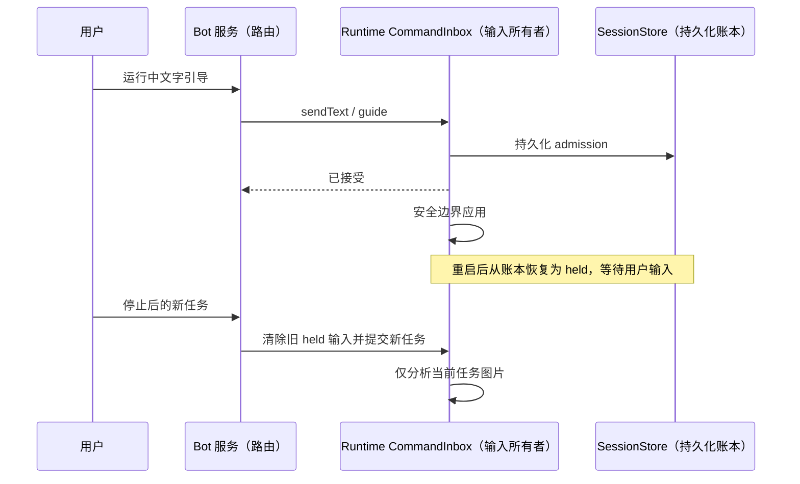

# Running text guidance and stopped-task isolation
Running Weixin text input goes through the existing v4 sendText CommandInbox with
requestedDelivery=guide; do not use the normal start-turn facade that clears live
projection. ACK means accepted, not applied. Existing runtime safe boundary injection,
owner/lease and command deduplication remain authoritative. Attachments during running
receive an explicit text-only guidance message rather than being silently dropped.
Stop remains the existing stop command.

Preserve unconsumed user sendText guide ledger records on cold resume and reproject
them as held inputs, with original identity and submission metadata. Do not execute
them during hydration. Ordinary queue/background wake handling is unchanged. Text
guide persistence failures propagate rather than claiming durable acceptance.

New input after stop must not automatically analyze old image batches. Only explicit
continuation reuses the original task's images; new substantive input sees historical
image placeholders and current-turn images. Persisted originals/checkpoints remain.
Scope: large image collections (>10); small normal visual followups retain existing
behavior. A model can explicitly reread original files when new task needs old media.

验收：51 张历史图片后输入“PDF 在哪里？”不触发批量分析；明确“继续”
仍复用原任务检查点；恢复未消费引导不调用模型；账本读取失败不得报告恢复成功。
