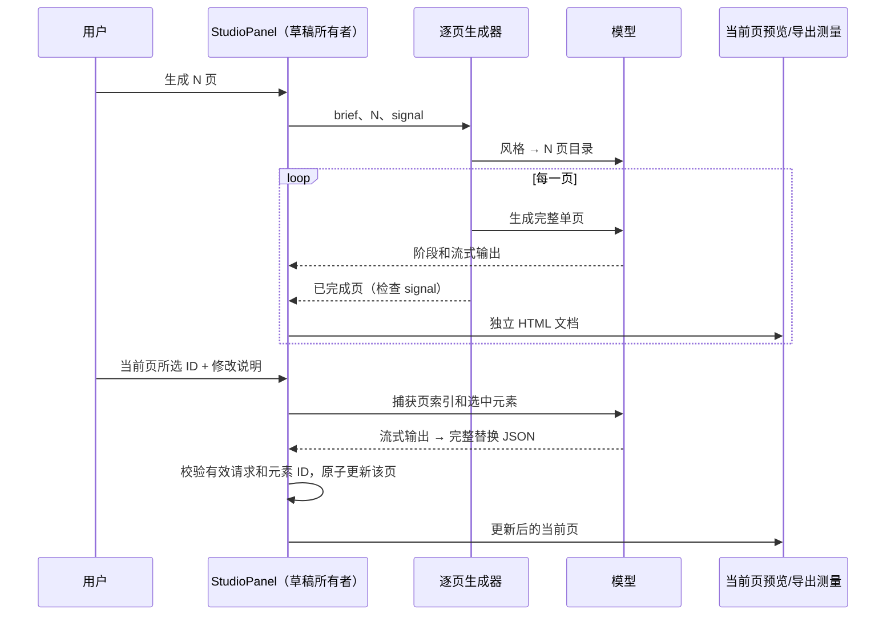
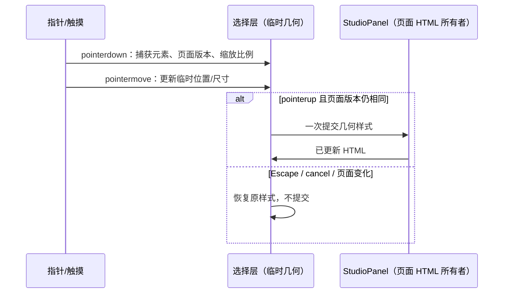
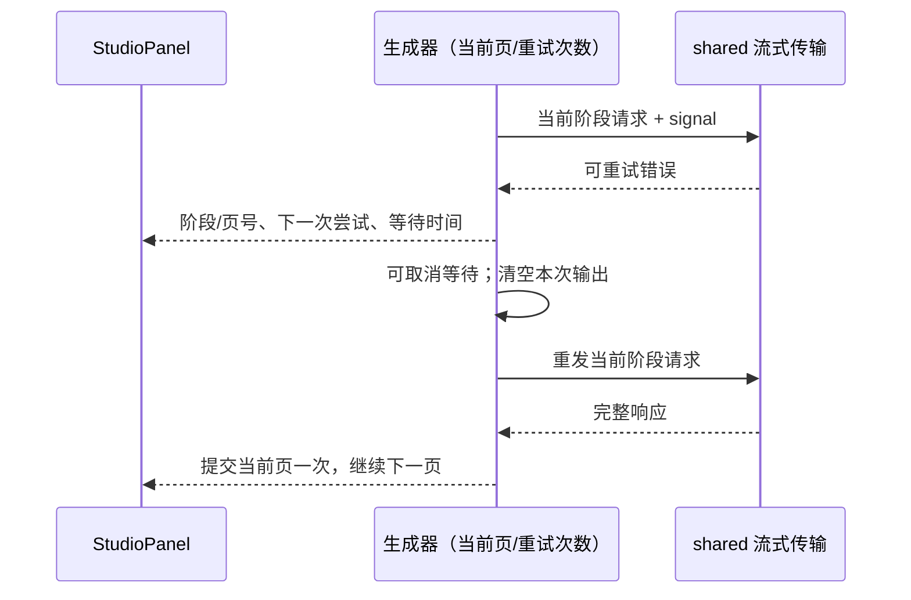

# 创作面板

对话框里的创作面板负责生图、生视频和可编辑 PPT。它不是无限画布，也不把步骤画成流图。

## 所有者

- 面板组件持有提示词、手绘、讨论文本、生成结果和 PPT 草稿。
- ZenMux API Key 只从当前模型设置读取，不另存一份。
- 生成请求在渲染进程直接调用 ZenMux，和多 Agent 工作区同一条路径。

## 行为

- 每一次生图或改图之前，意图、美术、挑刺、成稿四个角色按顺序流式发言。意图角色使用用户选的意图模型，其余角色轮流使用其他对话模型。意图模型在这一轮不再担任其他角色；没有其他模型时，其余角色仍用它。思考档位按模型记住。参考图和带笔迹的合成图会作为图片附在讨论消息里。成稿写出 `FINAL:` 后，这一行单独显示为最终提示词，然后才请求生图。生成出的图片显示在讨论下面。
- 生成出的图片可以拷贝到剪贴板，也可以保存成本地文件。
- 生成过程中结果区显示动态图形，讨论区继续保留已流出的文字。
- 空白手绘只说明主体和构图。除非用户明确要求手绘、线稿、素描或涂鸦，否则生成自然照片，不把手绘线条原样描出来。从手绘生成的图再做二次修改时同样如此：笔迹只说明要改的内容，不把彩铅、蜡笔或纸纹保留下来，除非用户原文写明要这种画法。已经有照片时，笔迹仍只改被盖住的区域，改过的部分也是自然照片。默认保留每种笔迹自己的颜色。关掉「保留笔迹颜色」后，笔迹只当作修改范围。参考图可以粘贴或拖放，以缩略图列出，右上角可以删除。
- 画板和生成图都按原比例显示。滚轮缩放；画板按住空格拖移，生成图直接拖移。画笔是笔尖光标，橡皮擦是橡皮光标，只有平移才是手型。
- PPT 有引导式表单和直接对话两种入口。总页数可以选 5、8、10、12、15 或 20，也可以自己填。生成时按这个页数写出一份 1280×720 的分页 HTML。如果一次写不完，就接着写剩余页，直到页数够。模型夹带的控制符号会从正文里去掉。然后再保存成一个可编辑的 `.pptx`。可以拖放或粘贴附件。图片以缩略图列出，其他文件以文件名缩略卡列出，右上角可以删除。文本、Word、PDF、演示文稿和表格会读出正文再写进讨论，不只传文件名；图片附件和参考图一样交给委员会。先写出 1280×720 的分页 HTML，每页用 `data-pptx-slide`，可见元素用 `data-pptx-kind` 标成文字、形状或图片，并带稳定的 `data-pptx-id`。生成结果如果没有标分页，就按并列的 section、slide 节点，或大约 720px 高的子页来分页，预览可以翻页。可见文字即使没标种类，也会补成可点选的文本框。保存前要等测量页真正解析完，并像预览一样一次只显示一页。文字按这一页里实际画出的位置写入，边框高度为 0 时用字形的矩形，不能收成一列满宽文字，也不能因为没量到边框就报没有可编辑文字。保存时按页测量这些元素，写成标准 `.pptx`：文字是文本框，色块是形状，照片和流程图都是图片，其他应用可以打开并编辑。流程、分支、对比或步骤页要有内联 SVG 示意图；测量时把 SVG 光栅成图片，不把矢量拆成无法编辑的整页截图。正文不小于 28px，只有页脚可以到 15px。写入 PPT 前若一行末尾只剩几个字，就加宽文本框把它拉回去；文字超出色块时加高或加宽色块，不把正文字号再缩小。版式仍是杂志风或瑞士风的 16:9。应用内预览保留整份 HTML，只显示当前页，避免拆出单页后父级样式失效。正文画在色块上面。深色代码块用浅色字。预览按盖住这段字的最小色块判断，不用整页浅底把字留成深色，并用 important 盖过样式表里的深色字。字色和背后的底色太接近、或文字被移出页面时，改成能看清的颜色和位置。有代码、分支、对比或步骤的页要有内联示意图，不靠那一张照片代替。成稿、委员会和改所选都带同一条硬性规则：深色代码块必须写浅色字，禁止继承成黑色；这些页必须自带示意图。每一页 section 中间要有标题和正文，不能只剩页眉页脚。分栏和配图与保存后的 PPT 对齐。用户可以另写附加要求，生成和改所选都会带上。成稿模型从当前对话模型里选，由它写出幻灯片。意图模型也从这些对话模型里选，生图、生视频和 PPT 的讨论都由它担任意图。它和成稿模型在这一轮都不担任其他角色；生成结束，这轮剔除就结束。只有一个对话模型时，委员会仍用这一个。`typesafe/jev-1.13` 只用于 System One 判断，不进入委员会，也不能选成成稿模型。成稿模型和委员会里的每个对话模型，如果该模型配置了思考档位，就按主界面同一套档位选择并写进这次请求；没有档位的模型不传思考参数。档位按模型分别记住。预览有选择模式开关，默认关闭。打开后点选元素，选中项在幻灯片上用蓝色描边标出，悬停时用虚线框标出，按住 Shift 可多选。预览下方有单独的修改区，用自然语言交给成稿模型；这里可以粘贴或拖放图片，以缩略图列出，右上角可以删除，这些图片只用于这次修改。
- 选择模式打开后，悬停是虚线框，点中的是该元素自己的蓝色实线加半透明底，不是整页外框。在当前页点选一个或多个元素后，可以把用户写的修改发给模型。模型的回复要流式显示在修改区。它按每个元素的 id 交回替换后的 HTML，并立刻写回这一页；只替换这些元素，不改同一页的其他元素，也不改其他页。若选中的是图片且用户要换图，仍先走委员会再生图，再换掉该图片地址。
- 生图、生视频或 PPT 成功后，实际使用的提示词写入本机提示词库。点一条会填回输入框。可以勾选后批量删除。同一条不重复保存，最多保留 30 条。
- 模型设置里列出 ZenMux 目录中的生图模型和视频模型，名称用模型 ID。可以添加新的模型 ID，可以删除，也可以点选缺省模型。缺省生图模型是 `openai/gpt-image-2`，缺省视频模型是 `google/veo-3.1-fast-generate-001`。
- 画面比例和视频时长在创作面板生成时选择，选项来自该模型在 ZenMux 上的 api_info。比例随这次生成请求发出，不写进设置。
- 生成 PPT 时，成稿用 `MEDIUM:` 决定要不要一张照片。`image` 时再开一轮生图委员会，然后调用设置里的生图模型，照片只通过 `{{ILLUSTRATION}}` 放一次。流程图不靠这张照片，由页面自己画内联 SVG。`none` 表示不配照片。
- 生成出的图回到画板，可以直接在上面画笔迹。按手绘修改会再走委员会，并替换当前这张图。底图来自手绘时，结果仍是自然照片，除非用户明说要手绘。底图是照片时，只改笔迹覆盖的区域。已经嵌进 PPT 的同一张图也会一起替换。

## PPT 逐页生成与编辑（2026-09-26 修订，替代整份 HTML 续写）

- StudioPanel 是 `deckPages: string[]` 的唯一所有者；每项是完整、独立的 1280×720 HTML 文档。当前页索引和选中 ID 是局部 UI 状态。不得合并不同页面的 CSS，不把未闭合流式 HTML 提交为页面。
- 生成入口使用同一条风格 → 精确页数目录 → 逐页生成路径。目录不足需重试并明确失败，不能用重复的默认页凑数。每页完成即加入草稿并可预览；只有完成请求页数才能报告完成。失败保留已完成页并显示失败，停止保留已完成页。
- 预览每次只挂载当前页的独立文档；导出也逐页测量同一文档，再写入同一个 PPTX。文字、色块、图片保留元素类型和稳定 ID；SVG 作为一个图形元素选择。
- 单选及 Shift/Ctrl/Command 多选仅作用于当前页。翻页清空选择。编辑请求捕获当前页和所选 ID，完成后仅更新该页中这些元素；重复 ID 在页面准备时修正，防止误改另一元素。
- 生成阶段、当前页/总页数和实际收到的模型输出实时可见。编辑区显示等待、流式响应、完成、失败、停止；不伪造模型处理过程。JSON 完整校验后原子替换，未完成或取消的响应不写入草稿。
- AbortController 是本次请求的有效性令牌；回调和提交都检查仍为当前请求且未取消，旧请求不覆盖新结果。此功能仍是窗口内的创作草稿，不改变 Host/CLI owner、desktop-continuous 或 web-remote-replayable 协议。

### 验收场景

1. 请求 20 页，模拟目录与 20 次单页响应：完成数依次为 1…20，第 20 页可导航，导出包含 20 页。
2. 两页使用同名 CSS 类和不同位置/颜色：翻页后各自样式不串页，非当前页文字不重叠。
3. 选择一个/多个文本、形状或 SVG：描边对应元素；翻页清空；编辑只修改捕获页面和所选元素。
4. 延迟响应时编辑区在最终 JSON 到达前显示内容；失败/取消保留原元素；旧请求回调不覆盖当前草稿。
5. 第 6 页失败：已完成 5 页保留，界面明确失败，不能把 5 页标成 20 页完成。
6. 桌面与窄屏可翻页、选择、查看输出并停止请求。

### 本次验证记录

- 执行 `node packages/ui/tests/studio-ppt.browser.mjs`：通过。使用本机 Chrome 和模拟 SSE 响应，覆盖 20 页逐页提交、20 页 PPTX ZIP 内容、独立坐标/CSS、文字/形状/SVG 测量、重复 ID 修正、真实预览单选/Shift 多选/第 20 页导航、完整 StudioPanel 的编辑流先显示后提交、停止不改内容、第 6 页失败保留 5 页。
- 没有调用真实模型 API，未验证真实模型的文案或美术质量。测试从仓库根目录执行，需要可用的 Chrome。
- `pnpm architecture:check --changed`：通过，0 violations。改动限于 UI 创作模块及其中英文文案，草稿所有者为 StudioPanel。
- 本次修改的 6 个实现文件与 2 个浏览器测试文件定向 oxlint：通过。
- `pnpm typecheck`：未通过，未修改的 studioMediaStore.ts 第 70、71 行存在 string | undefined → string 错误。
- `pnpm lint`：未通过，studioMediaCatalog.ts、ProviderModelMetadataDialog.tsx 和 release-artifacts 内两个文件违反 max-lines；未改动这些文件。
- 环境没有 mise 或要求的 Node 24.14.0，实际验证使用 Node 25.8.1。PPT 创作模块在开始时即为未跟踪本地文件，git diff 不能提供本轮精确净行数；保留原有其他本地改动。

## 元素拖动与缩放（2026-09-26）

- 选择模式下拖动元素内部移动；选中框提供八个缩放手柄。多选时拖动整体移动，缩放整体包围盒，元素位置和尺寸按比例变化；文字改变文本框大小并重新换行，不自动改变字号。
- StudioPanel 继续独占页面 HTML。指针移动只修改当前 iframe 临时预览；pointerup 一次提交所选元素的几何样式。翻页、页面版本变化、Escape 或 pointercancel 取消并恢复临时预览；禁止过期提交。生成和 AI 编辑时禁用几何操作。
- 屏幕位移除以当前画布比例得到 1280×720 坐标位移。尺寸最小 16px。移动保持组内相对位置；选中祖先和后代时只操作祖先，避免重复位移。不写入选中描边、悬停等预览装饰。
- 桌面鼠标与触摸均使用 Pointer Events 和 pointer capture；指针离开元素仍能完成操作。导出测量与后续 AI 编辑读取已提交的同一 HTML。

验收：半尺寸和窄屏预览下拖动坐标正确；单选八方向缩放，多选移动和缩放；取消无改动；翻页回来几何保持；导出文字坐标和尺寸与提交值一致；AI busy 时不能拖动。

### 小元素与深层元素

- 支持 1×、1.5×、2×、3× 预览放大（相对适应宽度），放大后滚动浏览，几何操作使用实际画布缩放比例。
- 当前页提供可折叠元素列表，包含普通 HTML 的嵌套元素、文本、形状和图片；显示类型、简短内容和 ID。点击选择，Shift/Ctrl/Command 多选。不依赖视觉尺寸和遮挡顺序。SVG 保持一个可编辑图形单元，不把内部 path/text 伪装成可单独导出的对象。
- 画布点选允许小于 2px 的可见对象，并提供 4 屏幕像素命中余量；优先最小元素，父层与被遮挡元素可从列表选择。
- 生成提示补充流程图标签最小 24px、代码最小 28px、空间不足应简化或分栏，禁止缩成微型图。字号规则是生成约束，不擅自放大既有页面而造成新的重叠；既有结果可通过放大、列表选择和 AI 编辑调整。

本轮验证：`node packages/ui/tests/studio-ppt.browser.mjs` 通过，新增覆盖半尺寸画布移动与缩放、组移动与组缩放、深层 tiny/parent 列表选择、翻页后位置保持、导出坐标一致、2× 放大和 Escape 恢复；原有生成/流式编辑回归仍通过。`pnpm typecheck` 仍仅报未修改的 studioMediaStore.ts 两处既有类型错误；`pnpm lint` 仍为既有 4 处 max-lines 错误。本轮不修复这些无关文件。

## PPT 网络重试

- 风格、目录、单页生成各自最多尝试 3 次（首次 + 2 次重试），不重新跑已完成页面或委员会。网络建立/读取中断、流未正常结束、HTTP 408/429/500/502/503/504 可重试；401/403/其他参数错误、HTML/JSON 本地处理异常、主动取消不属于网络重试。
- shared 的流式传输接口提供带 HTTP 状态、retryable 和 Retry-After 的结构化错误。PPT 请求要求完整结束事件；避免流被静默截断后误当作完整内容。已有其他调用者默认结束策略不变。
- PPT 生成器拥有重试次数；StudioPanel 只投影阶段、页号、次数和等待时间。等待 1 秒、2 秒，服务端 Retry-After 可延长至最多 30 秒。等待和在途请求均可取消；旧请求不能更新新生成任务。
- 每次尝试独立累积输出，重试前清空失败尝试的输出，不拼接两次 HTML。只有完整页成功后提交一次。重试上限耗尽时保留已完成页面，提示失败阶段/页号、尝试次数和错误原因。
- 不记录 API Key、输入正文或模型输出。此重试不表示恢复服务端相同请求，可能产生新的模型请求；不无限重试，也不把鉴权错误当网络问题。

验收：第 6 页首次断流、第二次成功时最终 20 页且前 5 页不重复；429 遵从有限 Retry-After；401 不重试；连续失败仅请求 3 次；等待中停止不再发请求；残缺输出不与重试响应混合；重试状态在完整面板可见。

截图补充：委员会成稿阶段也可能在首个输出前断网。委员会每个角色与所选元素 AI 编辑复用同一个有限重试执行器；重试仅重置当前角色/当前编辑的输出，不重复此前角色，不提交残缺编辑。没有完成页时失败文案为“生成失败，尚未完成任何页面”。

重试验证：`node packages/ui/tests/studio-retry.browser.mjs` 通过，覆盖断流后清空残片、网络异常重试、401 不重试、503 三次上限、Retry-After 和等待中取消。完整浏览器测试额外模拟委员会成稿首次 network error 后成功，以及第 6 页断流后重发一次，最终仍为 20 页（只发出 21 次单页请求）；失败在首张页面之前不再声称保留已完成页。未调用真实模型，无法据截图确认此次实际断网的上游原因。架构检查通过；全仓类型检查和 Lint 仍为前述既有失败，本次修改文件定向 Lint 通过。

## ZenMux 应用名称

- 所有发往 ZenMux 的模型请求设置 `X-Title: ZenCoder`，值大小写固定，不拼接平台、版本或模型名。
- shared 的 `ZENMUX_APPLICATION_HEADERS` 是唯一名称来源。流式聊天（含重试）、非流式聊天、System One 和模型鉴权检查，以及创作面板图片/视频请求复用它。
- CLI SDK 的现有 ZenMux fetch adapter 在传输边界覆盖旧的 X-Title，保留鉴权、其他请求头与原有 temperature 移除行为。非 ZenMux 请求不改动；下载媒体资源不附加模型请求头。
- 验收：用模拟 fetch 捕获上述请求头；字符串 URL 与 Request 两种 SDK 输入均得到准确标题；重试保留标题；非 ZenMux 原样转发。无需真实 API 请求或 UI 更名。

## 目录规划失败诊断与定向修复

- 原始用户内容和委员会建议分开传递。委员会只提供内容/视觉建议，不能改写规划阶段的 JSON 契约、页数或逐页 1280×720 输出规则；讨论阶段不再要求整份网页 HTML。
- 目录解析返回具体原因：空回复、JSON 语法/截断、pages 非数组、实际页数不符、指定页 title/brief 缺失。接受标准 JSON 代码围栏及带解释文字的完整 JSON 对象，不用首个 `{` 到最后一个 `}` 粗暴截取整段文本。
- 最多两次语义修复，每次明确提供上一轮原始回复及校验错误，要求修复指定结构；不再无反馈地重复同一个请求。网络重试仍单独受既有上限控制。
- 目录输出预算按页数增加（至少 8192 tokens，最多 24000），每页 brief 简短而具体。保留严格页数与必填内容验证，不用重复占位页凑数。样式允许多页复用布局，只避免连续重复，取消“超过布局种类数量仍完全不能重复”的矛盾要求。
- 若最终失败，界面自动展开本次 AI 输出并显示具体校验原因，保留用户可复制的回复；不把目录格式问题写成网络失败。
- 验收：围栏内 JSON 前后存在带花括号说明；页数不足、缺字段、截断分别给出原因；后续修复请求包含原回复与对应错误；最终失败保留详细原因；20 页正常流程与网络重试不受影响。

本轮验证：目录解析 3 项单测通过；浏览器模拟目录 9/10 页及第 4 页缺 brief 后，确认修复请求包含原回复与具体错误，第三次修复成功并生成 10 页。已有 20 页、断流重试、选择、移动缩放、导出与编辑回归通过。本轮未获得用户失败时完整 JSON，也未调用真实模型；截图本次触发的是哪一项校验仍未确认，不将候选原因写成已验证根因。定向 Lint 与架构检查通过；全仓 typecheck 与 lint 保持此前既有失败。

## 列表选中后的画布控件

- 列表单选后将画布选中对象的操作控件滚动到可见区域；Shift/Ctrl/Command 多选保留列表位置。
- 选中框四角显示固定屏幕尺寸的高对比缩放手柄，保留边缘手柄；靠画布边缘时手柄向内夹取，不能被 overflow 裁掉。
- 选中框提供明确的移动控件，直接操作当前 selectedIds。列表选中嵌套容器后，拖动此控件不重新命中更小的子元素，保持操作对象一致。
- 继续使用原有 useSlideGeometry → StudioPanel HTML 提交路径，无新增几何状态所有者。列表选择 → 测量选中框 → 显示/滚动到控件 → 指针预览 → pointerup 提交；取消和 stale-source 规则不变。
- 验收：列表选择后四角与移动控件可见；嵌套父元素拖动不会改选子元素；四角缩放分别改变预期几何；画布边缘手柄不裁切；原有多选、取消、导出回归通过。

## 单页渲染版式验收与修复

- 当前生成器只有 HTML 完整性检查，没有渲染检查。新增离屏 1280×720 测量，使用与预览相同的 prepare/show/present 路径，检查可见文字字形越界、文字超过自身文本框，以及独立文本块字形重叠。色块与文字的正常包含不算重叠。
- 单页首次输出不合格时，把该页 HTML 和具体元素 ID、坐标、问题交回模型修复，最多修复两次；通过后才提交该页。仍不通过则保留此前已完成页并明确报告，不能把叠字页当成功。
- 页面布局规则明确标题区、正文区、页脚区与列间距；代码不得裁切，过长行应改成语义等价的短行或分栏，禁止靠缩小正文和 overflow:hidden 隐藏内容。
- “修复当前页版式”入口复用同一测量/修复流程，显示流式输出，成功后仅替换捕获页且源 HTML 版本仍相同；失败/取消保留原页。修复保留事实、元素 ID、图片来源，不擅自增加页数。
- StudioPanel 仍拥有唯一页面 HTML，测量 iframe 是只读临时投影，不保存第二份草稿。流程：模型单页 → 实际渲染 → 问题反馈 → 修复/再次渲染 → 提交当前页。
- 验收：文字交叠、长代码越界、页脚压正文能检出；正常卡片底色包含文字不会误报；第一次坏版式第二次修复通过仅提交一次；修复耗尽不提交；修复当前页不改其他页；原有拖动与四角操作回归通过。

### 主题必须落到页面

- 主题不再只通过自然语言提示传递。杂志风使用暖白纸色、衬线标题、深色正文和陶土强调色；瑞士风使用白底、无衬线标题、深色正文和红色强调色。统一主题模块定义调色板与字体，写入 HTML 的 CSS 变量、body 和标题/卡片/强调元素样式。
- 生成和版式修复使用相同主题定义；页面保存 data-studio-theme，导出沿用该 HTML。切换主题立即应用已有页面，并清空选择；字体改变可能引起换行，用户可随后用版式修复入口检查重排。
- 代码始终保留等宽字、深底浅字；照片与 SVG 内部不做全局改色，避免破坏内容。正文对比度继续由现有预览路径处理。
- 验收：模型返回错误 body 色/标题字体时，最终 HTML 仍使用所选主题；切换两种风格实际背景与字体变化；修复后主题不丢失；测量/导出读取相同背景。

本轮验收结果：真实 Chrome 中的模拟模型 E2E 通过，覆盖 20 页逐页生成、重试、元素列表和深层父元素选择、四角缩放、移动、取消、导出坐标、流式编辑、两种主题切换以及仅修复当前页并保留主题/其他页。独立版式测试覆盖重叠/越界检测、正常包含关系、修复成功与耗尽、主题与导出一致性。未调用真实成稿模型，未取得截图对应原始 HTML，因此不声称已验证该原稿的最终视觉效果。

全仓 `pnpm typecheck` 实际执行失败：既有 `studioMediaStore.ts:70,71` 的可选字符串类型错误。全仓 `pnpm lint` 实际执行失败：既有 studioMediaCatalog、ProviderModelMetadataDialog 和两个 release-artifacts 文件的 max-lines 错误。架构检查通过（0 violations）。

## 版式持续修复与进展（替代两次修复上限）

用户明确要求修复到通过。版式不合格不再因两轮上限终止；串行执行检查 → 问题反馈 → AI 修复 → 复检，直到通过或用户停止。网络/鉴权失败仍遵循传输层规则，不无限重试不可恢复请求。每轮以最新 HTML 和检测问题为输入，多轮未解决时要求重新安排内容区域，保留事实与元素 ID，禁止隐藏/删除内容绕过检查。

StudioPanel 是页面唯一所有者：候选 HTML 在修复调用内，只有通过检查后才提交。进度事件包含 checking/repairing/passed、修复轮次、问题列表，生成和手动修复均显示；停止会中断后续请求，不提交候选，不影响已完成页。事件顺序：Panel AbortController → 单页检查 → repairing(轮次/问题) → 流式输出 → checking → passed → Panel 原子提交。

验收：超过两轮仍继续，第 4 轮合格才返回；每轮进度携带最新问题；持续失败时点击停止退出且无新请求/提交；现有主题和页面隔离回归通过。

持续修复验收已执行：Chrome 测试确认第 4 轮修复进度和冲突信息可见、通过前原页面不变、通过后仅当前页替换；独立测试确认连续失败可取消。20 页生成、主题、选择移动缩放和流式编辑回归通过；定向 Lint 与架构检查通过。全仓 typecheck 仍为 studioMediaStore 两项既有错误，lint 仍为此前四项 max-lines 错误。测试使用模拟响应，未调用真实模型。

## 不完整 HTML 也进入修复循环

完整性检查此前在修复循环之外抛错，导致第一次或任意修复返回截断 HTML 时直接终止。现在把缺失文档边界作为 format 问题反馈，继续串行修复并显示轮次与原因。保留最近一次完整候选作为修复基底，同时附带不合格原始回复及原页内容要求，避免截断回复丢失正文。不得仅补闭合标签后当成成功；仍需完整输出并通过实际版式检查。取消和传输层错误行为不变，只有通过检查才提交。

验收：初始输出不完整能恢复；修复过程中连续不完整后仍恢复；后续请求包含最近完整页面、不合格回复和原页要求；进度包含格式问题，取消不提交。

验证：Chrome 中初始截断 HTML → 完整但重叠页面 → 再次截断 → 合格页面的恢复测试通过，确认格式进度与最近完整候选保留；完整面板、20 页生成与编辑回归通过。定向 Lint/架构检查通过。已执行全仓 typecheck/lint，仍为此前 studioMediaStore 两项类型错误与四项 max-lines 错误。未调用真实模型，截图无法确定上游输出不完整的具体原因。

## 五轮后保留并继续（替代持续修复）

每页最多执行 5 次 AI 修复，首次检测不计为修复。第 5 次仍不合格时保留最近完整 HTML，记录未解决问题，提交后继续下一页；不显示检查通过。当前页警告从页面 HTML 元数据派生，无第二份状态。手动修复同样遵守上限；成功后清除警告。若从未有完整 HTML，则不能伪造可用页面，仍报告格式失败。取消、网络失败规则不变。

事件：单页候选 → 最多五次修复/复检 → passed 或 retained → Panel 保存页面 → 生成下一页。验收包括恰好五次、保留完整候选、问题标记、下一页生成及取消。

五轮上限验证：Chrome 模拟第一页面持续重叠/越界，确认恰好 5 次修复后保留问题元数据，随后生成第二页；取消与第 4 轮通过场景仍通过。定向 Lint 和架构检查通过。全仓 typecheck/lint 已执行，仍有既有两项 studioMediaStore 类型错误和四项 max-lines 错误，未调用真实模型。

## 独立 PPT 修复模型设置

设置 → 模型页面增加 PPT 修复模型 ID，可填写服务支持的模型 ID，留空跟随成稿模型。本机持久化，由 ui/store 单一设置所有者管理；设置输入 → store → 每次生成/手动修复开始时捕获配置 → 修复请求。进行中的任务继续使用启动时配置，下一次操作读取新值。

自动格式/版式修复及“修复当前页版式”使用修复模型，规划、成稿及选中元素编辑仍使用原模型。推理参数按实际修复模型生成，不沿用成稿模型专属参数。沿用现有 ZenMux 凭据与五次上限。验收：保存/刷新恢复、清空后跟随成稿、自定义模型只影响修复请求、自动和手动路径一致。

修复模型验证：Chrome E2E 通过设置填写、持久化后刷新恢复、清空跟随成稿；自动与手动修复的模拟请求均断言指定模型 ID。20 页生成、修复上限、取消、主题和编辑回归通过。定向 Lint/架构通过。全仓 typecheck/lint 已执行，仍有此前 studioMediaStore 两项类型错误与四项 max-lines 错误。未调用真实模型服务。

## 混合正文导出与选择一致性

实际附件第 10 页 XML 只有标题/卡片标题/页脚，没有正文与代码。导出不能因容器有文本子元素而丢弃直接文本。准备 HTML 时将混合容器的直接文字与连续 br 包装成可编辑文本段，保持 DOM 顺序和可见文本；重复准备必须幂等。所有 body 元素 ID（包括仅有 ID 的元素）唯一，排除 head。预览、列表、几何写回共用准备规则。

Panel selectedIds 为唯一选择状态：画布/列表点击 → selectedIds → 当前 iframe 高亮、列表 aria-pressed 和几何控件。缩放命中使用屏幕矩形比例；列表明确选中底色。验收：混合标题+直接正文/br、嵌套 span 的导出正文存在且不重复；重复 ID 修正稳定；画布和列表双向同步、四角与移动控件可见、几何修改刷新保留。

## 修复覆盖导出层

实际渲染校验同时对比可见文本片段与可编辑 PPTX 测量结果；导出遗漏作为 export 问题发送给修复模型，与布局问题共享进度及五次上限。以真实导出测量路径为准，不宣称能模拟所有 WPS 排版差异。已缺失正文的旧 PPTX 无法从 XML 恢复未写入内容，需使用源 HTML 重新导出。

本轮验证：读取用户 PPTX 第 10 页 XML，确认正文/代码不存在（仅五个标题/页脚文字对象）。复现混合容器并导出，XML 包含正文与代码且不重复；准备幂等、ID 唯一、未预处理页面的几何写回通过。Chrome E2E 确认画布选中同步列表 aria-pressed、列表选中同步 iframe 标记、控件可见及移动缩放。导出遗漏 audit 场景与五轮修复回归通过。定向 Lint 和架构检查通过；全仓 typecheck/lint 仍为既有两项类型错误及四项 max-lines 错误。未在 WPS 打开重新导出的成品，未获得实际源 HTML，因此不宣称已完整修复原文件全部页面；旧 PPTX 中未写入正文无法单凭原文件恢复。

## 选择即时投影与可见边框

画布和列表仍仅写 Panel selectedIds；iframe load/布局回调必须读取最新选择，不能捕获旧 ID 覆盖手柄测量。选择变化时同步测量，iframe 字体/尺寸变化后重测。列表在选中时展开并只滚动自身列表容器至对应项，不移动画布。操作控件增加明确整体外框，始终处于拾取层上方，独立屏幕坐标盒固定定位；隐藏/零尺寸元素不产生无效框。测试检查双向同步、外框和四角可见且实际位于画布内。

选择同步验收：Chrome 回归通过列表自动展开、画布→列表 aria-pressed、列表→画布标记、外包围框和四角可见、移动/缩放与多选。尺寸更新基于宿主 ResizeObserver 与 iframe load/fonts.ready，避免在 iframe ResizeObserver 回调中写布局造成循环；最终浏览器运行无 ResizeObserver 错误。定向 Lint/架构检查通过；全仓 typecheck/lint 已执行，仍为既有两项类型错误与四项 max-lines 错误。尚未复现用户正在运行的具体页面，不能仅凭合成回归保证其现场问题已消失。

## 生成中选择/几何编辑和配图占位符

运行时确认：生成中 busy 禁止点击/隐藏手柄但仍显示悬停框；当前“比较运算符与布尔值”图片 src 实际为 {{ILLUSTRATION}}，naturalWidth=0，未替换资源。已完成页在后续页生成期间允许选择和几何编辑；生成提交仅追加新页，已有页面以 Panel 当前 HTML 为准，防止覆盖编辑。其他 AI 编辑/修复期间仍禁止并发写。移动/缩放 → 同版本 HTML 提交 → 后续页只追加 → 导出读取最终 HTML 的坐标。

配图在校验前绑定真实资源；无资源时明确告诉模型不要输出 img，占位符或加载失败图片记作 resource 问题参与修复。不得把占位符当图片成功。五轮后仍保留警告。验收：生成过程中操作已完成页且最终导出保留坐标；图片占位符有资源时绑定，无资源时检出。

## CSS 边框箭头与单边装饰导出

HTML 导出此前仅取 borderTop 并统一输出矩形边框，会把 CSS 三角箭头和单边色条变成完整矩形。对零内容宽高、仅一侧有不透明颜色的边框三角输出原生可编辑 triangle，并保留方向/颜色；非一致四边框分别输出四条原生矩形边，禁止把顶边扩展为四边。保持正常全边框、正文和几何坐标。测试验证 OOXML triangle、旋转及填色，并验证单边装饰不产生黑色四边框。

本轮实际运行证据：通过运行中 Electron 的 CDP 读取“比较运算符与布尔值”页，img src={{ILLUSTRATION}}、complete=true、naturalWidth=0；生成结束后列表点击确实更新 aria-pressed 并显示 8 个手柄。未启动额外应用或调用真实模型。Chrome E2E 新增生成过程中选中/移动已完成页，后续提交保留位置，既有导出坐标回归通过。混合文字测试同时验证 PPTX XML 存在 triangle 和 90° 旋转。配图占位符资源校验通过。架构及定向 Lint 通过；全仓检查仍为此前两项类型与四项 max-lines 错误。箭头已验证 OOXML，尚未在 WPS 对新导出文件实机验收。

## 实际杂志页：文字背景与行内文本换行

运行中的第 8 页源 HTML已取证。带 kind=text 的元素背景也必须输出；不能仅输出 shape 或无 kind 元素的背景。对 inline/pre/多行正文按浏览器实际字符 Range 的行矩形分段，保持行内强调文字位置和手动/自然换行；禁用导出时二次几何扩展，避免扩大文本框反向挤压卡片。单行块文本保持现有编辑坐标契约。中文文本显式选可用中文字体，等宽西文使用实际字体名称而非 monospace；每行文本框关闭自动折行。文本仍可编辑。

验证使用实际页 HTML 加合成跨行强调与代码底色，检查正文行坐标、背景和 OOXML no-wrap。不能仅靠 XML 断言声称 WPS 像素级一致，字体未安装仍可能被替换。

本轮应用修复验证：真实当前第 8 页 HTML 使用应用导出模块重新生成 /Users/nellertcai/Documents/zencode-slide8-fixed.pptx；代码背景和行内分段回归通过，原有 20 页/编辑/导出坐标回归通过，版式与资源检查回归通过。已执行全仓 typecheck/lint，仍为 studioMediaStore 两项类型错误与四项既有 max-lines 错误。架构及目标 Lint 通过。尝试在 WPS 打开样例时 CUA 原生连接关闭，未完成新文件显示的实机确认，不宣称像素级一致。
