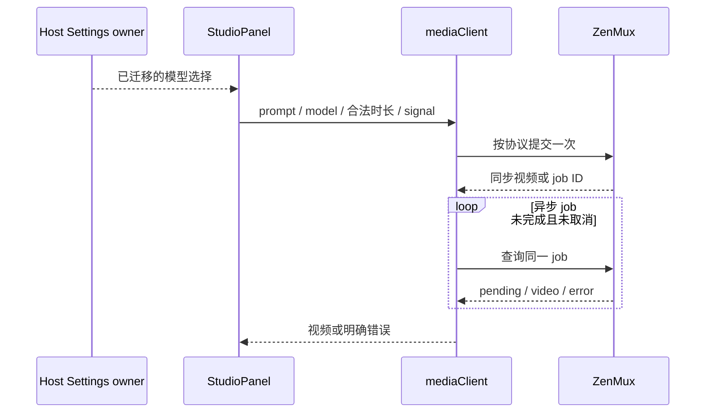

# ZenMux 视频模型协议与可用目录

## 产品规则与证据

2026-10-02 对照 https://zenmux.ai/models?output_modalities=video 、站点公开模型 `api_info`、Vertex/原生视频/Interactions 文档核对模型。目录声明的视频输出不代表模型支持 Veo 请求路径，也不代表某账号当前能生成。用中性英文物体场景、目录最短时长、16:9 和低分辨率，实际提交并等待视频结果；结果按成功、提交失败、生成失败、网络/限流/额度受限分别记录。只将完整成功模型纳入本轮内置目录。账号或供应商余额问题只说明本次受限，不推定模型永久不存在。一次最短时长测试不宣称所有时长/图生视频组合已实测。

- 每个内置模型明确 `vertex`、`native` 或 `interactions` 协议，时长/比例来自当前 `api_info`；实际请求必须使用对应字段。Interactions 使用 `response_format: {type: "video", aspect_ratio, duration: "Ns"}`，参考图使用原生图片 content。
- 时长下拉框具有独立的国际化可访问名称，不能把选项文字拼入控件名称。UI 显示选中模型的时长/比例；切换到不支持当前值的模型后选择新模型的第一个合法值。模型请求拒绝非法选项，不静默发出不支持的时长。
- 默认模型必须是保留目录成员。历史内置且本轮未保留的 ID 从旧设置清理，删除后默认选择有效模型；全被清理时恢复可用内置列表。不删未知自定义 ID，不重建其他设置。未知自定义模型保留现有 Vertex fallback，能力未获认证。
- 调用取消后停止等待/轮询；不重复提交视频任务。临时轮询网络或 429/5xx 可在有界期限内重试同一 job；404/参数/鉴权等终止并显示模型、HTTP 状态、错误类型及请求 ID。不在日志或报告写密钥、原始响应、base64、视频签名 URL。
- 不递归寻找任意 URL 并误把参考图片、缩略图或原生的 last_frame_url 当成生成视频。仅接受协议定义的输出视频字段；明确报告上游生成失败/审核原因/无视频结果。

## 所有者与边界

Shared 公开的纯 builder/parser 和模型目录是协议/能力单一来源。mediaClient 负责异步网络请求和任务轮询，StudioPanel 持有本次运行的 AbortController；Host Settings 服务仍拥有模型选择，现有设置写队列负责迁移持久化。UI 经现有 hook 读取快照，不新增缓存或任务事实。

本次不改变 desktop-continuous 与 web-remote-replayable 会话传输语义；视频请求仍由同一面板执行。旧 run 取消后不得继续轮询；上游已接受任务不因取消而再次提交。

## 验收

- 各协议 request builder 的 endpoint、时长字段、比例、参考图结构正确；非法时长在 fetch 前拒绝。
- Gemini Omni 不再发 Veo 路径；仅解析 model_output 视频，不把 user_input 图片当结果。
- Vertex videos 的 gcsUri/base64，native content.video_url 可用；pending 不提前结束；终止错误不变成超时；临时轮询故障不重复 POST 提交。
- Abort 同时覆盖 fetch 和轮询等待，不产生挂起的计时器。
- 设置迁移幂等、旧默认清理、有效用户选择和自定义 ID 保留；两窗口的既有写队列不被绕过。
- 浏览器验证设置模型切换及合法时长在不同模型之间变化，以及所有协议模拟生成成功和取消。

实测汇总与保留项见 [2026-10-02 审计](studio-video-audit-2026-10-02.md)。
