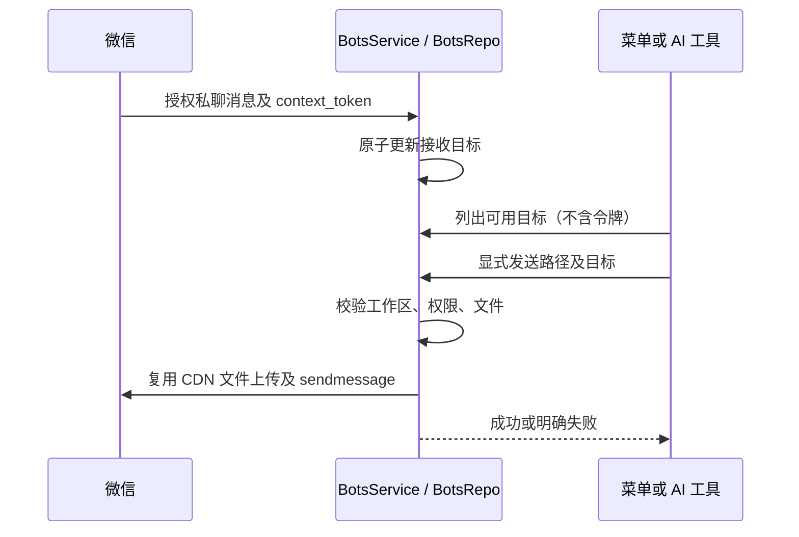

# 微信文件分享

文件树及聊天文件链接的上下文菜单提供发送到微信；AI 通过 SendWeixinFile 工具
响应“把这个 PDF 发到微信”等明确请求。生成文件不等于授权发送；工具先列目标，
消歧文件后再发送。按用户要求默认优先最近一次授权入站通道（updatedAt），显式指定接收方时遵从指定。发送普通文件并保留文件名。

BotsService 是发送的唯一所有者。BotsRepo 原子保存已授权私聊的最新 context_token，
不向 UI/模型返回令牌。发送时重新校验 enabled、白名单、工作区范围、文件 realpath、
普通文件和 20 MB 上限。只允许当前工作区文件；远端文件不按本机同名路径处理。
无会话令牌提示用户先在微信发消息。传输失败不自动重发，以免重复交付。

UI 经 hook → IBotsService；AI 经 typed protocol → Host 注入当前 workspace → 同一服务。
服务回包成功后才显示发送完成；发送中禁用重复点击。重启恢复接收目标但不重放发送。
Desktop/mobile 使用同一 Host RPC，不新增 poller 或业务队列。

验收：单目标发送、多目标默认最近连接、禁用/未授权不可发送、路径越界/目录/空文件/
超限拒绝、传输错误不重试；菜单可点击及成功/失败反馈；自然语言实际调用工具而非
仅回复“已发送”。没有真实微信消息验证时必须注明。

## 交互验收场景（需实机）
1. 绑定微信并发一条消息，在聊天生成文件链接上右键 → 发送到微信，确认微信收到
   相同文件名和字节的文件；文件树入口重复该操作。
2. 上传期间菜单保持打开且发送项禁用，完成后出现成功提示；断网只出现错误。
3. 两个授权接收方先后发消息，默认发送给后者，前者不收到副本。
4. 在对话输入“把刚生成的 PDF 发到微信”，检查工具事件和最终接收文件；未提供
   明确文件时由模型询问，不从目录随机挑选。
5. 手机远控经现有 Host 路由验证菜单；远程文件入口禁用，不能误发本机同名文件。
