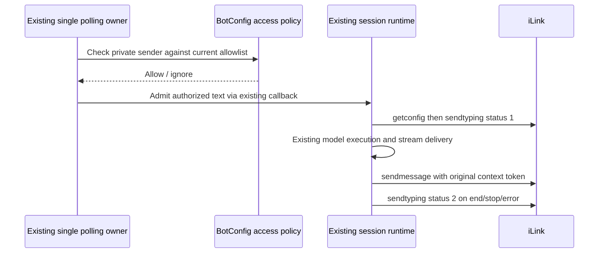

# Weixin milestone C: authorized text agent

## Rules and ownership

B live ping/pong was user-confirmed on 2026-09-27. C is a separate change.
BotConfig owns an optional weixinAllowedUsers list. Absent list defaults to the
persisted scanning weixinUserId; explicit empty list denies everyone. Missing
scanning identity also denies until configured. Never use the bot's own ID as a
user fallback. Only private @im.wechat actors are eligible. Multiple allowed users
share the existing bot workspace/session, explicitly disclosed in Settings.

Check this policy before echo or provider callback dispatch and at existing business
authorization. Configuration refresh must replace the poller's closed-over policy.
Unauthorized messages are silently ignored and their cursor can advance. Existing
admitted tasks keep runtime ownership; changing policy affects subsequent admission.
No new model client: disabling Echo uses existing Bot → CommandInbox → configured
Agent/model route, including the configured OpenAI-compatible provider. Credentials
remain in CredentialService. Do not switch users to AI mode automatically.

Typing operations serialize per bot/user so a delayed start cannot overtake its stop.
Typing failure cannot fail model work. Existing task lifecycle owns refresh timers;
no second scheduler or session owner. Desktop continuous and mobile replayable task
streams are unchanged. No database migration. Media capabilities are milestone D.

## Acceptance

- Tests: scanner default, explicit allow/deny, absent identity, group rejection,
  auth helpers and echo enforce the same policy.
- Protocol: typing statuses 1 and 2, exact context token, missing ticket no-op,
  delayed start then stop leaves cancellation last.
- Browser: edit allowed-user list, default scanner fallback, empty-list denial,
  persisted controlled Echo switch; input labels available in both locales.
- Existing agent reply route remains authoritative; live AI reply requires a user
  test after installation and is not implied by B's ping/pong acceptance.

Typing lifecycle refinement: begin at authorized inbound processing, including file
preparation, with a temporary lease in the existing typing owner. Transfer coverage
to the task lease before releasing preparation. Multiple leases for the same recipient
must not cancel each other. Retain typing through final message delivery, then stop
in finally on completion/error. Coalesce pending refresh calls to avoid a growing
queue on a slow network. Missing typing ticket is a protocol capability limitation;
do not claim the Weixin UI displayed a state based only on a successful API call.
