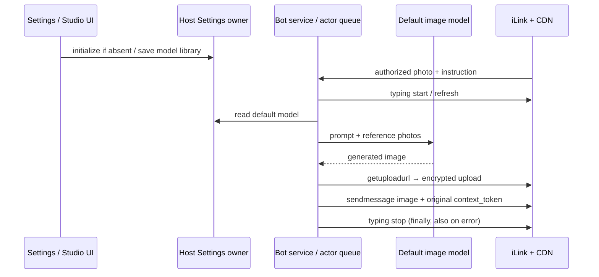

# Weixin image generation and photo editing

Use the system Studio default image model, never the conversation text model or a
separate Weixin override. Move the Studio media library to AppSettings (setting
service is the owner); renderer localStorage is only a one-time legacy import.
Both Studio and Weixin resolve the same catalog and request builder.

Weixin supports /image <prompt> and explicit generation/edit requests. Capability
questions receive instructions, not a paid generation. Ordinary photo analysis
continues through the Agent. Reference photos use existing authorized attachment
cache/decryption. Text/image processing retains the existing preparation typing
lease through generation, upload and send; all failures return a visible error.

Owner/event order: authorized inbound → Bot service → default model snapshot →
image API → encrypted CDN upload → sendmessage → release typing lease. Generation
is not retried automatically (avoids duplicate paid calls); media upload has a
bounded timeout. Do not expose keys, local paths or base64 in chat text. No second
poller or Agent session is created. Remote workspaces must not silently execute a
local media request. Existing desktop/mobile session delivery semantics stay intact.

Image upload uses fresh AES-128-ECB PKCS7 key, raw MD5/size and encrypted size,
getuploadurl, POST ciphertext, required x-encrypted-param, then type 2 image_item
with encrypt_type 1 and base64(hex key). Each message has a unique client_id and
returns original context_token. Send explanatory text separately.

Acceptance: custom default model reaches the request unchanged; supported photos
are included; text-only model rejects photo editing; capability query makes no
API call; decrypted uploaded bytes equal generated bytes; missing CDN headers or
API failures do not report success; sender receives an image item, not a URL.
Tests use fake credentials and generated fixture bytes, no paid requests.

Legacy import runs through Settings.initializeStudioMediaLibrary: the Settings write
queue checks absence before committing, so late migrations cannot overwrite a new
selection. Server validates defaults against lists. Studio uses host-specific hook
snapshots, not a process-global mirror. Recent reference photos persist only paths,
MIME types, sender ID and timestamp in the existing Bot context; expire after 30
minutes and are never reused across senders. Image-only input asks for instructions;
/image after a photo edits it, and explicit photo analysis goes to the existing Agent.
Only ZenMux credentials may be sent to the fixed ZenMux image endpoint.

2026-09-27 validation: protocol/settings/model tests and real browser default-model
selection passed; Desktop production compilation passed. No paid model call or live
Weixin image delivery was performed in these tests. Live acceptance remains pending.
